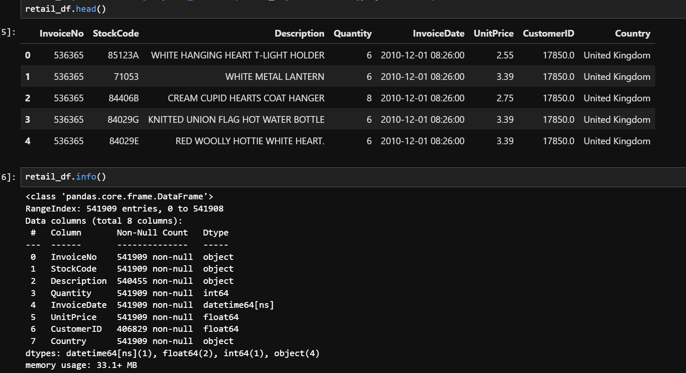

# Customer Segmentation Project

## Part 1: EDA (Exploratory Data Analysis)

## **Data Overview:**

 it contains 8 columns: 

- Invoice No
- StockCode
- Description
- Quantity
- InvoiceDate
- UnitPrice
- CustomerID
- Country




## **Preprocessing:**

- Remove NA values
- Drop the row with unit price = 0
- Check unique values all columns


- Handle the New customer because It misses the customerID:
    - Get the highest CustmerID as a milestone to mark as 1827
    - Merge to final_unique_inv to get the TRUE customerID
    - There is the negative amount in Quantity
        
        
        
    
    These could be the expenses or the offset amounts from customers
    

## Transform Data:

- Calculate the Gross Revenue by UnitPrice * Quantity
- Explore Data by ydata_profilling


## Build RFM:

```
Transactions timeframe from 2010-12-01 08:26:00 to 2011-12-09 12:50:00
539394 Transactions have Null customer.
There are 5983 unique customers.
```

Create an RFM analysis for each customer:

- **Recency:** Period ****between the max date of data and the latest buying date of customer
- Frequency: The total times customer bought products
- Monetary: Total amount customers bought


Check Boxplot between Frequency and Monetary because there are many outlier on these


Calculate RFM quartile and create RFM groups


Classify group by professional knowledge into 8 groups:

- Inactive
- Engaged
- New
- Rich
- Potential
- VIP
- Active
- Other


Number of segments:

```
inactive     1412
VIP          1094
active       1028
other         665
new           609
potential     572
rich          306
engaged        80
Name: label, dtype: int64
```

Create the TreeMAP and Scatter Plot according to RFM groups.


## Cluster RFM by Machine learning:

### **Overview:**

- View distribution of each column to determine what scaler we should use


There is no normal distribution in this dataset => Use Min Max scaler

### **Preprocessing data:**

- Remove categorical data => help model not bias
- Use 4 columns to train model: 'recency', 'frequency', 'monetary','rfm_score’
- Apply scaler for these columns

### **Build Model and Tune Params:**

- **Kmeans:**
    
    According to Silhouette score and Inertita error, I selected from 2 to 12 cluster, please follow the following result:
    
    ```
    With cluster 2 silhouette score: 0.63	 inertia_errors: 11033.42
    With cluster 3 silhouette score: 0.59	 inertia_errors: 5316.34
    With cluster 4 silhouette score: 0.59	 inertia_errors: 3140.55
    With cluster 5 silhouette score: 0.59	 inertia_errors: 2161.1
    With cluster 6 silhouette score: 0.59	 inertia_errors: 1362.55
    With cluster 7 silhouette score: 0.63	 inertia_errors: 1025.94
    With cluster 8 silhouette score: 0.69	 inertia_errors: 721.23
    With cluster 9 silhouette score: 0.73	 inertia_errors: 494.03
    With cluster 10 silhouette score: 0.81	 inertia_errors: 235.09
    With cluster 11 silhouette score: 0.78	 inertia_errors: 212.44
    With cluster 12 silhouette score: 0.79	 inertia_errors: 157.11
    ```
    
    
    
    
    
- **Hierachical Clustering:**
    
    According to Silhouette score and Inertita error, I selected from 2 to 12 cluster, please follow the following result:
    
    ```
    With cluster 2 silhouette score: 0.63	 inertia_errors: 0
    With cluster 3 silhouette score: 0.54	 inertia_errors: 0
    With cluster 4 silhouette score: 0.56	 inertia_errors: 0
    With cluster 5 silhouette score: 0.58	 inertia_errors: 0
    With cluster 6 silhouette score: 0.61	 inertia_errors: 0
    With cluster 7 silhouette score: 0.65	 inertia_errors: 0
    With cluster 8 silhouette score: 0.68	 inertia_errors: 0
    With cluster 9 silhouette score: 0.73	 inertia_errors: 0
    With cluster 10 silhouette score: 0.73	 inertia_errors: 0
    With cluster 11 silhouette score: 0.81	 inertia_errors: 0
    With cluster 12 silhouette score: 0.81	 inertia_errors: 0
    ```
    
    
    
- Evaluation:
    
    As can be seen from the above plots of **Silhouette Score** , we could use n_cluster = 10 of Kmeans or n_cluster = 11 of Agglomerative cluster
    
- **PCA:**
    
    **Hierarchical Clustering:**:
    
    
    
    Kmeans:
    
    
    
    As we can seen, the kmeans give the cluster more clearly than the Hierarchical Clustering. ⇒ Choose the Kmeans with 11 segmentations.
    
- **Kmeans Pyspark:**
    - Use 4 columns: `recency|frequency|monetary|rfm_score|features`
    - Apply Min Max Scaler for these columns
    - According to Silhouette score and Inertita error, I selected from 2 to 12 cluster, please follow the following result
        
        ```
        With k = 2 - Silhouette = -0.156 - Inertia value: 32005.076
        
        With k = 3 - Silhouette = -0.264 - Inertia value: 17106.413
        
        With k = 4 - Silhouette = -0.358 - Inertia value: 13591.516
        
        With k = 5 - Silhouette = -0.618 - Inertia value: 11972.145
        
        With k = 6 - Silhouette = -0.474 - Inertia value: 8823.154
        
        With k = 7 - Silhouette = -0.444 - Inertia value: 7041.612
        
        With k = 8 - Silhouette = -0.405 - Inertia value: 6350.329
        
        With k = 9 - Silhouette = -0.488 - Inertia value: 5291.273
        
        With k = 10 - Silhouette = -0.489 - Inertia value: 4894.225
        
        ```
        
    
    
    
    According to the visualization, I choose the cluster 4.
    
    Create the Tree Map:
    
    
    
    According to silhouette score and Inertia Error, I recommend using Kmeans with 10 clustering.